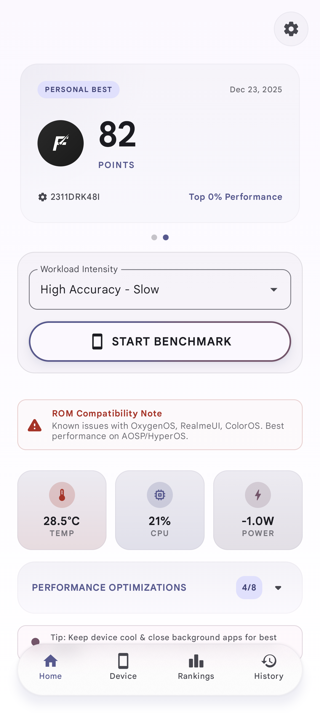
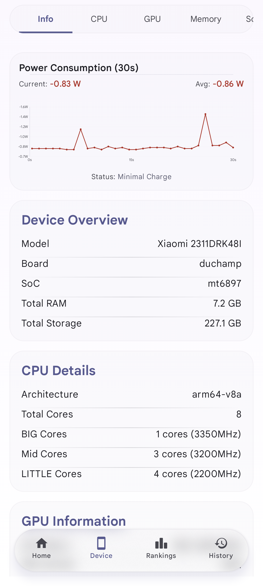
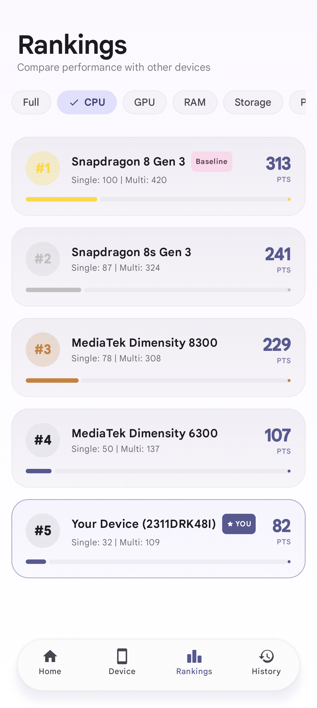
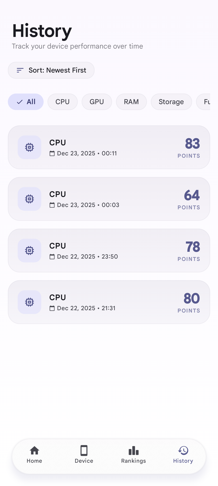
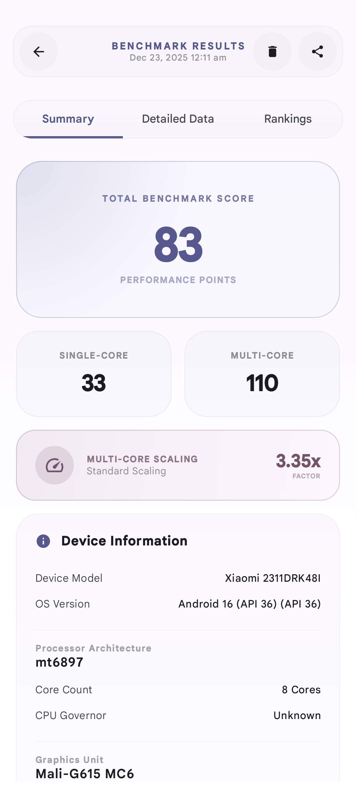
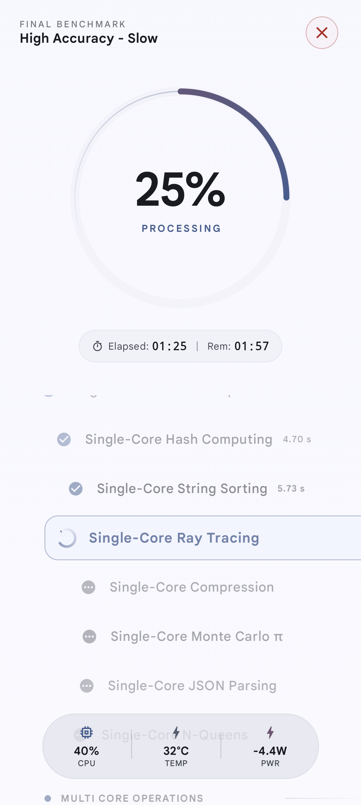
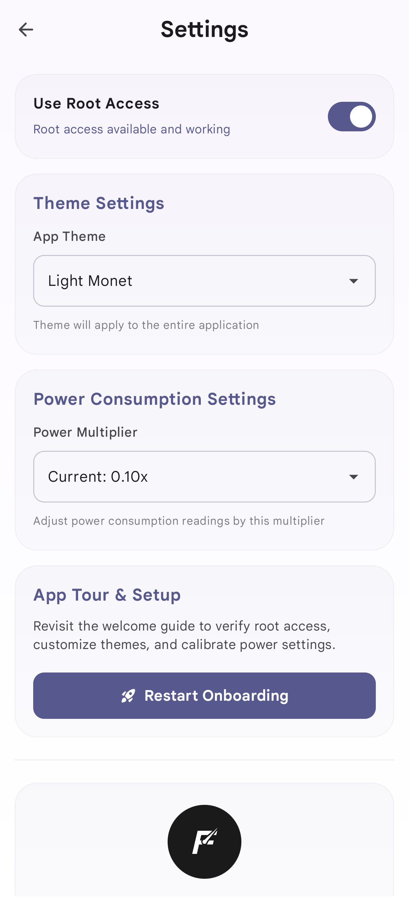
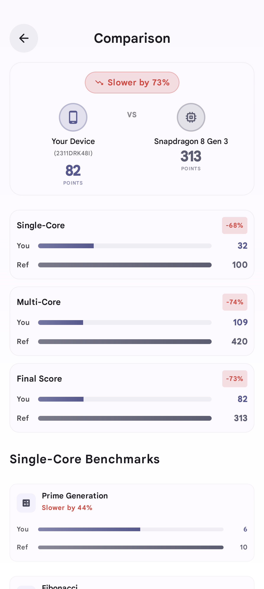

<div align="center">


# FinalBenchmark 2

<a href="https://f-droid.org/packages/com.ivarna.finalbenchmark2">
  
</a>

---

[](https://discord.gg/khzKmGzfRf)
[](https://github.com/abhay-byte/finalbenchmark-platform/releases)
[](https://github.com/abhay-byte/finalbenchmark-platform/stargazers)
<br>
[](LICENSE)
[](https://kotlinlang.org/)
[](https://github.com/abhay-byte/finalbenchmark-platform/releases/latest)

A comprehensive Android CPU, GPU, RAM, Storage, AI/ML, and Productivity benchmarking application with detailed scoring and visualization.

<br/>


</div>

---

## 📱 Screenshots

<div align="center">
  <table>
    <tr>
      <td align="center">
        
        <br/>
        <sub><b>Home Screen</b></sub>
      </td>
      <td align="center">
        
        <br/>
        <sub><b>Device Info</b></sub>
      </td>
      <td align="center">
        
        <br/>
        <sub><b>Results</b></sub>
      </td>
      <td align="center">
        
        <br/>
        <sub><b>Running Tests</b></sub>
      </td>
    </tr>
    <tr>
      <td align="center">
        
        <br/>
        <sub><b>History</b></sub>
      </td>
      <td align="center">
        
        <br/>
        <sub><b>Rankings</b></sub>
      </td>
      <td align="center">
        
        <br/>
        <sub><b>Settings</b></sub>
      </td>
      <td align="center">
        
        <br/>
        <sub><b>CPU Comparison</b></sub>
      </td>
    </tr>
  </table>
</div>

---

## 🚀 Features

- **Comprehensive Multi-Component Benchmarking**: Tests and evaluates CPU, AI/ML, GPU, RAM, Storage, and Productivity performance in a single platform.
- **Advanced Benchmark Modes**:
  - **Full Benchmark**: Runs all 46 tests sequentially to generate overall and category-specific scores.
  - **Throttle Test (Stress Test)**: Sustained heavy CPU + GPU workload (10/30/60 mins) tracking clock speeds, thermal throttling, and performance retention over time.
  - **Efficiency Test**: Measures performance output relative to power consumption (points/watt) and battery drain.
- **Robust Scoring System**: Normalized scores relative to a reference baseline (Snapdragon 8 Gen 3) using geometric means to ensure fair evaluation.
- **Results History**: Local SQLite storage for historical runs with detailed, interactive performance graphs.
- **Global Rankings**: Compare your device against other benchmarked Android devices with offline/online sync.
- **Export & Share**: Shareable result cards and raw exports in JSON, CSV, or text formats.
- **Premium UI/UX**: Fluid design using Jetpack Compose with Material Design 3, real-time progress, and dark/light themes.
- **Thermal & Power Monitoring**: Active tracking of battery/CPU temperatures, power usage (watts), and battery drain rate during execution.

## 📋 Benchmark Tests (46 Total)

### 💻 CPU Tests (10 tests)
*All tests run in both **Single-Core** and **Multi-Core** configurations:*
- **Prime Generation**: Evaluates integer math using prime verification (Pollard's Rho).
- **Fibonacci Iterative**: Tests basic loops and iterative calculations.
- **Matrix Multiplication**: Tests floating-point and memory alignment throughput.
- **Hash Computing (SHA-256/MD5)**: Measures cryptographic hash generation performance.
- **String Sorting**: Evaluates array manipulation and sorting algorithms (Quicksort).
- **Ray Tracing**: Measures floating-point and spatial computing speeds using Perlin Noise.
- **Compression (LZMA)**: Tests data compression/decompression algorithms and memory throughput.
- **Monte Carlo**: Simulates mathematical approximations using randomized algorithms (Mandelbrot Set).
- **JSON Parsing**: Tests text processing, string manipulation, and object tree instantiation.
- **N-Queens**: Tests recursion, backtracking, and CPU branch prediction.

### 🧠 AI/ML Tests (5 tests)
- **LLM Inference**: On-device Large Language Model inference (llama.cpp with TinyLlama-1.1B/Gemma 3).
- **Image Classification**: Object recognition in images using ONNX Runtime (MobileNetV3).
- **Object Detection**: Identifies and bounds objects in real-time (EfficientDet Lite0).
- **Text Embedding**: Natural language vector generation (MiniLM-L6).
- **Speech-to-Text**: High-fidelity on-device audio transcription (Whisper-tiny).

### 🎮 GPU Tests (10 tests)
- **Native GPU Tests**:
  - **Triangle Rendering**: OpenGLES/Vulkan stress rendering pipelines.
  - **Compute Shader Matrix**: Heavy matrix multiplication run on GPU hardware.
  - **Particle System**: Simulation of 100K+ interactive physical particles.
  - **Texture Sampling**: High-resolution texture cache sampling and fillrate test.
  - **Tessellation**: Geometry subdivision and dynamic LOD rendering.
- **External GPU Tests (Unity / Unreal)**:
  - Separate deep-linked high-fidelity rendering benchmark APKs (2 Unity scenes, 3 Unreal scenes) that communicate real-time FPS and frame times back to the main app.

### 💾 RAM Tests (5 tests)
- **Sequential Read/Write**: Measures block transfer speeds in system memory.
- **Random Access Latency**: Detects memory latency and page hopping speed.
- **Memory Copy**: Evaluates byte array copying throughput.
- **Multi-threaded Bandwidth**: Measures concurrent core access speeds.
- **Cache Hierarchy**: Tests L1/L2/L3 cache sizes and latency transitions.

### 📦 Storage Tests (6 tests)
- **Sequential Read & Write**: Benchmarks internal storage file reading and writing speeds.
- **Random Read/Write**: Tests storage IOPS with 4KB non-contiguous blocks.
- **Small File Operations**: Stress-tests storage index metadata speed with thousands of small files.
- **Database Performance**: Evaluates query/transaction speeds using local SQLite databases.
- **Mixed Workload**: Simulates simultaneous reading and writing activities on internal storage.

### ⚡ Productivity Tests (10 tests)
- **UI & Dynamic Rendering**: Measures RecyclerView scrolling, Canvas rendering speed, dynamic UI layout, and text/typography rendering operations.
- **Media Workloads**: Heavy image processing (batch resize, color filters) and video processing (H.264/H.265 encoding, transcoding).
- **Document Workloads**: High-page PDF document generation and rendering tests.
- **Multi-tasking**: Simulates heavy background workloads run concurrently with active UI animations.

## 📂 Benchmark Documentation

For detailed technical specifications, design documents, and implementation plans, check out the documentation under the [/docs](docs/) directory:
- [Overview & Full Features](docs/features.md)
- [Benchmark Index](docs/benchmark/index.md)
  - [CPU Benchmarks Details](docs/benchmark/cpu.md)
  - [AI/ML Benchmarks Details](docs/benchmark/aiml.md)
  - [GPU Native Benchmarks Details](docs/benchmark/gpu_native.md) / [GPU External Benchmarks Details](docs/benchmark/gpu_external.md)
  - [RAM Benchmarks Details](docs/benchmark/ram.md)
  - [Storage Benchmarks Details](docs/benchmark/storage.md)
  - [Productivity Benchmarks Details](docs/benchmark/productivity.md)
- [Database Schema & Architecture](docs/database/)
- [Benchmark Modes & Configurations](docs/modes/)

## 🔧 Building

```bash
git clone https://github.com/abhay-byte/finalbenchmark-platform.git
cd finalbenchmark-platform
./gradlew assembleDebug
```

## 📄 License

This project is licensed under the Apache 2.0 License - see the [LICENSE](LICENSE) file for details.

---

<div align="center">

## 💬 Discord

Join our community to discuss benchmarks, get support, and share feedback!

<a href="https://discord.gg/khzKmGzfRf">
  
</a>

</div>

---

<div align="center">

Made with ❤️ by [Abhay](https://github.com/abhay-byte)

</div>
